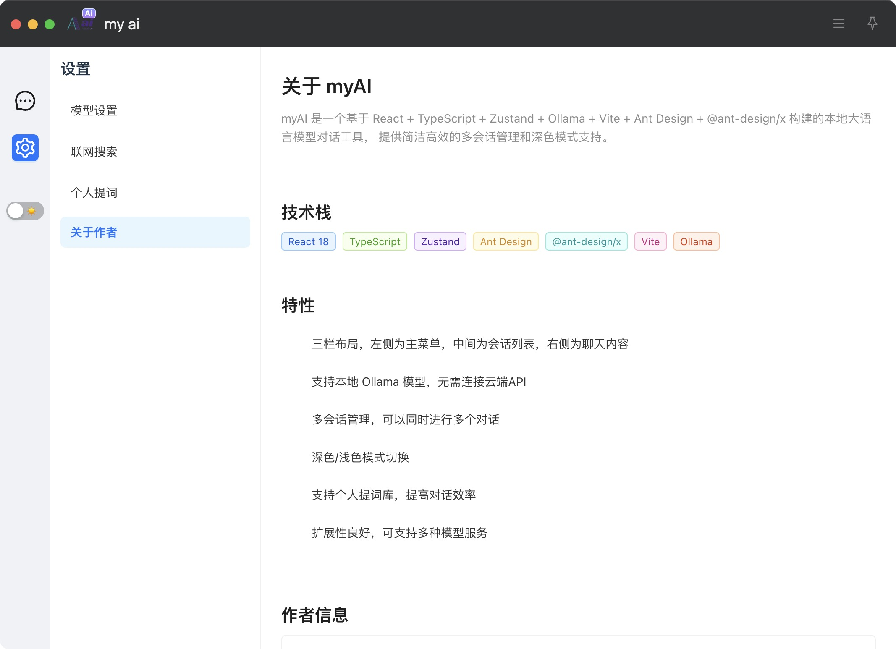
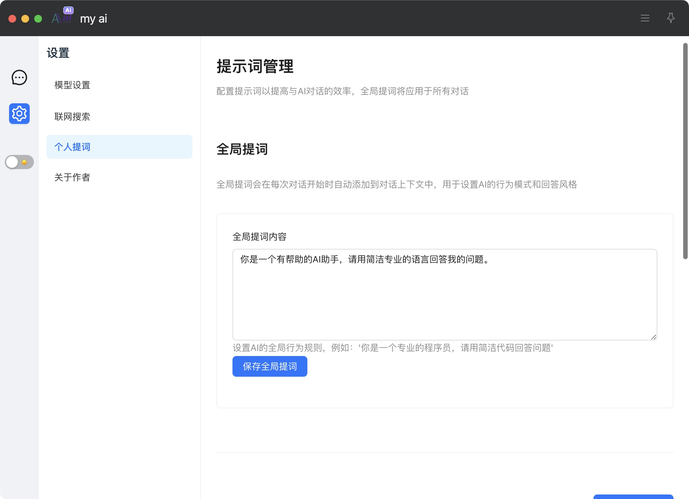
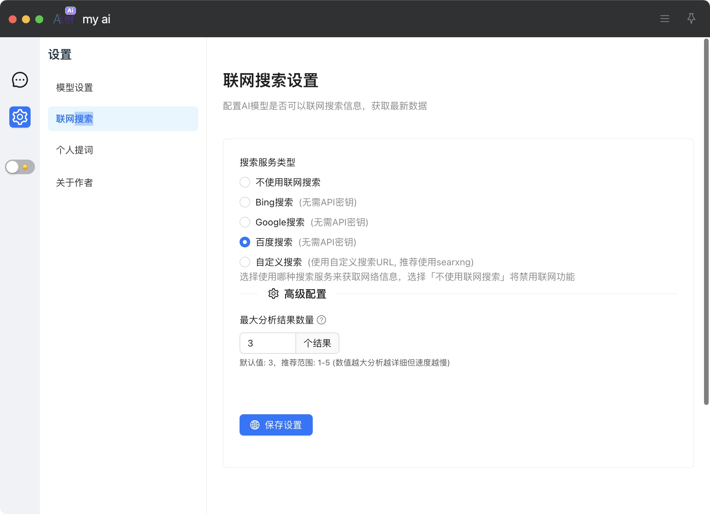
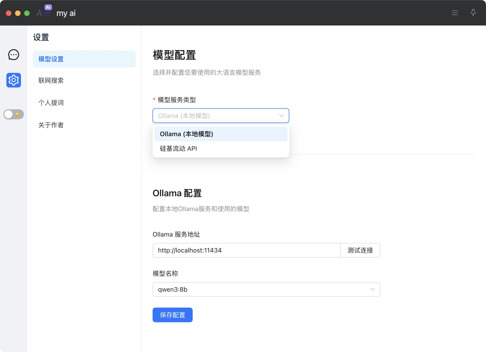
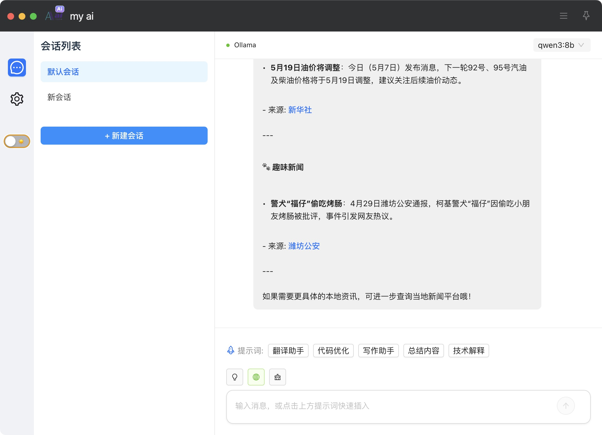

# MyAI - 智能AI助手插件

## 项目简介
MyAI是一个智能AI助手插件，支持本地大模型对话和云端AI服务。界面采用左中右三栏结构，设计简洁高效，易于使用。

## 主要特点
- 🔍 多模型支持：支持Ollama本地模型、硅基流动、OpenAI、百度文心一言、阿里通义千问、智谱AI、MiniMax、讯飞星火等主流平台
- 🔍 智能网络搜索：自动判断是否需要联网查询，支持多搜索引擎
- 💡 思考过程可视化：支持查看模型的思考过程，提高透明度
- 🎨 主题切换：支持深色/浅色主题切换
- 📝 消息管理：支持消息建议、快捷输入、复制、删除、重新提问等操作
- 🔄 多会话管理：支持创建和管理多个对话会话
- ⚡ 流式响应：支持实时流式输出，提供流畅的交互体验

## 最新更新
- 支持所有主流大模型平台的无缝切换与参数配置
- 所有模型配置组件集中在 `src/pages/ModelSettings/` 目录，结构清晰
- 支持@路径别名（`@`指向`src`目录），所有import更简洁
- 路由和组件全部采用静态import，优化首屏加载体验
- 所有API Key等表单均有必填项校验，未填写时会有友好提示

## 界面布局
- 左侧：一级菜单（会话、设置等）
- 中间：会话列表（支持多会话切换与新建）
- 右侧：聊天对话框（与AI模型对话）

## 配置方法
1. 进入"设置-模型配置"页，选择你要使用的大模型平台
2. 填写对应平台的API Key、Secret、模型等参数，点击"测试API Key"可校验有效性
3. 保存后即可在聊天界面直接使用所选平台
4. 支持随时切换平台，参数自动记忆

## 使用方法

### 安装依赖
```bash
# 设置代理
export https_proxy=http://127.0.0.1:7890 http_proxy=http://127.0.0.1:7890 all_proxy=socks5://127.0.0.1:7890

# 安装依赖
pnpm install
```

### 开发环境
```bash
pnpm dev
```

### 生产构建
```bash
pnpm build
```

## 更新日志
详细的更新记录请查看 [update.md](./update.md)

## 许可证
MIT License

## 文档导航
- [WebService模块架构设计](src/services/WebService/README.md)：详细介绍网络搜索模块的架构、扩展方式和使用方法
- [更新日志](update.md)：所有功能和优化的时间线记录
- [关于页面](src/pages/AboutPage.tsx)：技术栈、作者、版本信息

## 界面截图
界面设计参考如下截图，具体UI开发请见`files`文件夹：
- 
- 
- 
- 
- 
